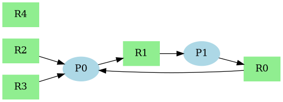
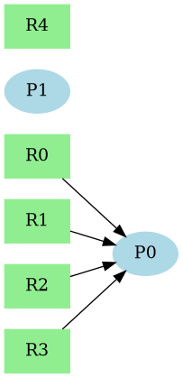
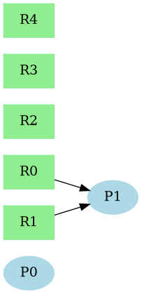
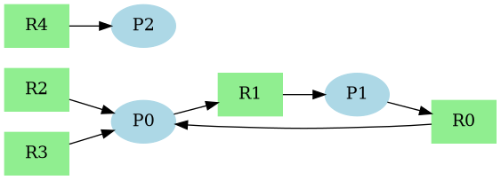
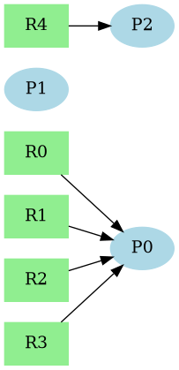
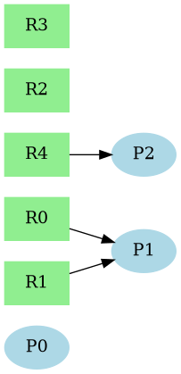

# Deadlock Detection and Recovery Using Suspension and Checkpointing

## Overview

This project simulates a multi-process system that can experience deadlocks and recover from them using a safe and efficient strategy. Instead of terminating or rolling back processes, the system suspends one process involved in the deadlock, saves its state (checkpoint), and restores it later when the system is safe.

The simulation uses a Resource Allocation Graph (RAG) to detect deadlocks, release held resources upon suspension, and ensure smooth, data-safe, and efficient recovery.


## Key Features

- Simulates a dynamic environment with multiple processes and resources
- Detects deadlocks using cycle detection in a Resource Allocation Graph
- Suspends the process holding the fewest resources to minimize impact
- Saves process state using checkpointing (held + requested resources)
- Releases held resources to allow other processes to continue
- Immediately reassigns freed resources to waiting processes
- Restores suspended processes when all their required resources are available
- Logs all steps of the simulation
- Visualizes before and after states using Graphviz diagrams

## System Architecture

The system is structured around modular components that simulate how deadlocks are handled in operating systems. Below is a high-level view of how the components interact:
```bash
detect_recover_deadlock/
├── core/ 
│ ├── environment.py
│ ├── process.py
│ ├── resource.py
│ └── graph_builder.py
├── detection/
│ └── detector.py
├── recovery/ 
│ └── recovery.py
├── visualization/
│ └── visualizer.py
├── utils/
│ └── logger.py
├── main.py
├── requirements.txt
├── README.md
└── output_images/
```

## How It Works

### 1. Deadlock Detection
The system builds a Resource Allocation Graph (RAG) where:
- Nodes = Processes and Resources
- Edges = Request or Allocation relations
A cycle in this graph indicates a deadlock. The system uses NetworkX to detect this cycle.

### 2. Process Suspension and Checkpointing
When a deadlock is detected:
- The system selects one process to suspend (based on the fewest held resources)
- The process's state is checkpointed (held + requested resources)
- All held resources are released

### 3. Resource Reassignment
Once a resource is released:
- The system immediately checks if any other process is waiting for it
- If so, the resource is reassigned automatically without delay

### 4. Process Restoration
Suspended processes are monitored:
- When all the resources they previously held and requested become available, they are restored from the checkpoint and resume execution


**## How to Run the Project**

### 🔧 Requirements

- Python 3.10 or higher
- pip
- Graphviz (for visualization)
- Required Python packages:
  - `networkx`
  - `graphviz`
  - `matplotlib` (optional for additional plotting)

### 📦 Installation

1. Clone the repository:
```bash
git clone https://github.com/your-username/deadlock-checkpointing.git
cd deadlock-checkpointing
```
2. Create a virtual environment and install requirements
```bash
./shells/install.sh
```
3. Running a Simulation
```bash
python main.py
```
## Visual Walkthroughs

### 🧪 Example 1: Two Processes, Simple Deadlock

**Step 1: Deadlock Detected**  
P0 and P1 are in a cycle:  
- P0 holds R0, requests R1  
- P1 holds R1, requests R0



**Step 2: Suspension and Smart Reassignment**  
P0 is suspended. R0 is released and reassigned to P1.



**Step 3: Suspended Process Restored**  
Once R1 is free, P0 is restored, and the system recovers.



---

### 🧪 Example 2: Three Processes, Isolated Suspension

**Step 1: Deadlock Detected**  
P0 and P1 are deadlocked. P2 is active but unaffected.



**Step 2: Suspension and Smart Reassignment**  
P1 is suspended. Held resource is reassigned to P0.



**Step 3: Suspended Process Restored**  
After P0 completes, P1 is restored. P2 was never interrupted.




## Author and Credits

Developed by **Md. Shihab Uddin**  
📚 Course: Operating Systems 
🎓 University of Alabama in Huntsville
